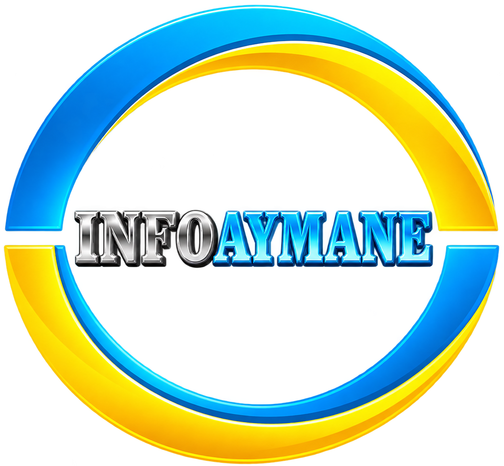

<div align="center">
  

  # InfoAymane — Agence Marketing Digital

  <p>
    <strong>Votre partenaire digital de confiance</strong><br/>
    Marketing digital, création web et communication visuelle à Casablanca, Maroc.
  </p>

  <p>
    <a href="https://www.infoaymane.com"></a>
    
    
  </p>
</div>

---

## 📖 À propos

**InfoAymane** est une agence spécialisée dans le marketing digital, la création de sites web et la communication visuelle. Nous accompagnons nos clients avec des conseils et des solutions complètes pour assurer la réussite de leurs projets digitaux.

## ✨ Services

- 🌐 Création et développement de sites web
- 📱 Marketing digital & réseaux sociaux
- 🎬 Montage vidéo
- 🎨 Communication visuelle

## 🛠️ Stack technique

- **Framework** : [Next.js](https://nextjs.org/) (App Router)
- **Langage** : TypeScript
- **Déploiement** : [Vercel](https://vercel.com/)

## 🚀 Démarrer en local

```bash
# Cloner le repo
git clone https://github.com/zakariach05/Agence-Aymane-info.git
cd Agence-Aymane-info

# Installer les dépendances
npm install

# Lancer le serveur de développement
npm run dev
```

Le site sera accessible sur [http://localhost:3000](http://localhost:3000).

## 📁 Structure du projet

```
├── src/
│   └── app/          # Pages et layouts (App Router)
├── public/           # Assets statiques (images, logo...)
└── next.config.ts    # Configuration Next.js
```

## 📬 Contact

Pour toute question ou collaboration, contactez-nous via [infoaymane.com](https://www.infoaymane.com).

---

<div align="center">
  <sub>© 2026 InfoAymane. Tous droits réservés.</sub>
</div>
